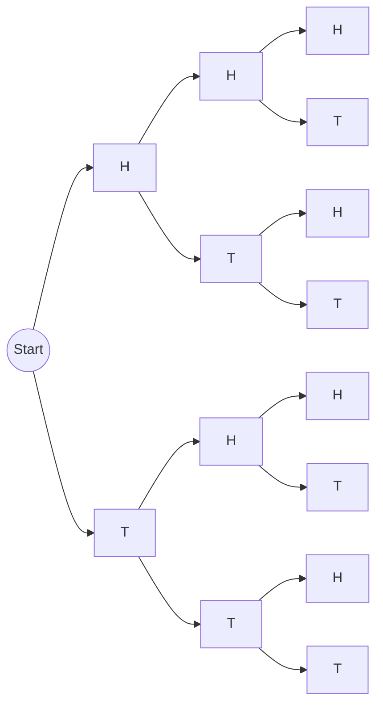
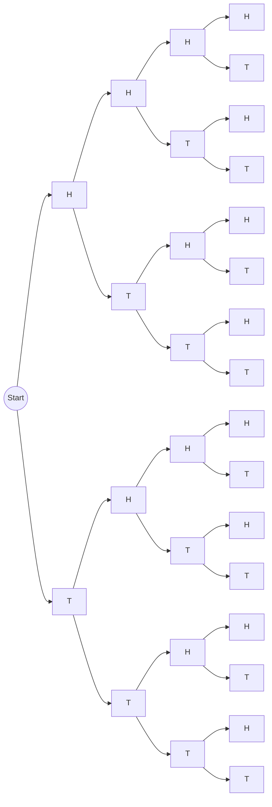

# Probability and Statistics
**BSCS 3rd Semester — Mid Syllabus Notes**

## Contents
- [[#Lecture 01 — Introduction & Basic Definitions]]
- [[#Lecture 02 & 03 — Probability]]
- [[#Statistics — Basic Terms]]
- [[#Worked examples — Dice and Coins]]
- [[#Lecture 04 — Conditional Probability]]
- [[#Lecture 05 & 06 — Probability Examples (Deck of Cards)]]
- [[#Multiplication Law]]
- [[#Lecture 07 — Random Variable]]
- [[#Counting Sample Points]]
- [[#Additive Law]]
- [[#Lecture 09 — Discrete and Continuous Random Variables]]
- [[#Lecture 10 — Bayes' Theorem]]
- [[#Corrections made while transcribing]]

---

## Lecture 01 — Introduction & Basic Definitions

### Random Experiment
> [!definition] Random experiment
> An action or process that can be repeated under the same conditions, but whose outcome **cannot be predicted with certainty**.

> [!example]
> Tossing a coin → H, T.

### Sample Space
> [!definition] Sample space ($S$)
> The set of all possible outcomes of an experiment.

> [!example]
> $S = \{H, T\}$

### Event
> [!definition] Event
> A **subset** of the sample space is called an event.

> [!example] Tossing two coins
> $S = \{HH, HT, TH, TT\}$
> - $A = \{HH\}$ → only heads appear
> - $B = \{TT\}$ → only tails appear
> - $C = \{HT, TH\}$ → both head and tail appear

### Types of Events
There are two types of events:
1. Mutually exclusive events
2. Not mutually exclusive events

#### Mutually Exclusive Events
> [!definition]
> Two events are mutually exclusive if they **cannot occur at the same time**.

> [!example]
> - When a coin is tossed, head or tail appears, but not both.
> - Rolling a die:
>   - $S = \{1, 2, 3, 4, 5, 6\}$
>   - $A = \{1, 3, 5\}$
>   - $B = \{2, 4, 6\}$
>   - $A \cap B = \phi$ → these are mutually exclusive (M.E.)

#### Not Mutually Exclusive Events
> [!definition]
> Two events are *not* mutually exclusive if they **can occur at the same time**.

> [!example]
> - $S = \{1, 2, 3, 4, 5, 6\}$
> - $A = \{1, 3, 5, 6\}$
> - $B = \{2, 4, 6\}$
> - $A \cap B = \{6\}$

---

## Lecture 02 & 03 — Probability

> [!definition] Probability
> The measure of the chance or likelihood that a particular event occurs.

$$P(E) = \frac{n(A)}{n(S)}$$

- $n(A)$ → number of outcomes in the **event**
- $n(S)$ → number of outcomes in the **sample space**

> [!example] Rolling a die — probability of an even number
> - $S = \{1,2,3,4,5,6\}$, so $n(S) = 6$
> - $A = \{2,4,6\}$, so $n(A) = 3$
>
> $$P(E) = \frac{3}{6} = \frac{1}{2} = 0.5$$

> [!important] MCQ
> Probability always lies between 0 and 1:
> $$0 \le P(A) \le 1$$

---

## Statistics — Basic Terms

> [!definition] Statistics
> The branch of mathematics that deals with **collecting, analyzing, interpreting and presenting** data into useful information, or for making effective decisions.

> [!example]
> - Used in education to analyze student performance.
> - Used in business.

### Data
> [!definition]
> A collection of raw facts, numbers and observations.

> [!example]
> Marks of students.

### Data Analysis
> [!definition]
> Studying the collected data.

> [!example]
> If you take the marks of students and find the average, you are doing data analysis.

### Types of Statistics
1. Descriptive statistics
2. Inferential statistics

#### Descriptive Statistics
Used to **summarize and describe** the main features of data.

> [!example]
> Mean, median, mode.

#### Inferential Statistics
Used to **make conclusions about a large group** based on data from a sample.

> [!example]
> A man starting a chocolate business picks some people from a large population, has them taste his chocolate, and draws a conclusion from their responses.

### Types of Data
1. Discrete data
2. Continuous data

#### Discrete Data
> [!definition]
> Countable data. It includes only whole numbers $\{0, 1, 2, 3, \dots\}$.

> [!example]
> Number of students in a class.

#### Continuous Data
> [!definition]
> Measurable data. It may be in decimal form.

> [!example]
> - Height of a student (e.g. 4.5 ft)
> - Weight of a student (e.g. 60 kg)

### Population
> [!definition]
> The entire group of individuals or items that you want to study.

> [!example]
> - All students of a school.
> - All people living in Pakistan.

---

## Worked examples — Dice and Coins

### Q: Probability of two dice
Sample space (36 outcomes):

|       | 1     | 2     | 3     | 4     | 5     | 6     |
| ----- | ----- | ----- | ----- | ----- | ----- | ----- |
| **1** | (1,1) | (1,2) | (1,3) | (1,4) | (1,5) | (1,6) |
| **2** | (2,1) | (2,2) | (2,3) | (2,4) | (2,5) | (2,6) |
| **3** | (3,1) | (3,2) | (3,3) | (3,4) | (3,5) | (3,6) |
| **4** | (4,1) | (4,2) | (4,3) | (4,4) | (4,5) | (4,6) |
| **5** | (5,1) | (5,2) | (5,3) | (5,4) | (5,5) | (5,6) |
| **6** | (6,1) | (6,2) | (6,3) | (6,4) | (6,5) | (6,6) |

Event $A$ = both dice show the same number:

$A = \{(1,1), (2,2), (3,3), (4,4), (5,5), (6,6)\}$

- $n(A) = 6$
- $n(S) = 36$

$$P(E) = \frac{n(A)}{n(S)} = \frac{6}{36} = \frac{1}{6} \approx 0.17$$

### Probability of two coins
- $S = \{HH, HT, TH, TT\}$, so $n(S) = 4$
- $A = \{HH, HT\}$, so $n(A) = 2$

$$P(E) = \frac{n(A)}{n(S)} = \frac{2}{4} = \frac{1}{2} = 0.5$$

---

## Lecture 04 — Conditional Probability

> [!definition] Conditional probability
> The probability of an event occurring **when another event has already occurred**.
>
> $P(A|B)$ = probability of $A$ given that $B$ has occurred.

> [!important] Formula
> $$P(A|B) = \frac{P(A \cap B)}{P(B)}$$
>
> $P(A \cap B)$ = probability that **both** $A$ and $B$ occur.

### Example — 3 fair coins tossed
Find the probability that:
- at least two tails appear
- the first coin shows head

$S = \{HHH, HHT, HTH, HTT, THH, THT, TTH, TTT\}$, so $n(S) = 8$

**Event $A$ — at least two tails:**
$A = \{HTT, THT, TTH, TTT\}$, $n(A) = 4$

$$P(A) = \frac{4}{8} = \frac{1}{2}$$

**Event $B$ — first coin shows head:**
$B = \{HHH, HHT, HTH, HTT\}$, $n(B) = 4$

$$P(B) = \frac{4}{8} = \frac{1}{2}$$

#### Tree method

#### Q: At least two tails appear, given that the first coin shows head
$A \cap B = \{HTT\}$, so $n(A \cap B) = 1$

$$P(A \cap B) = \frac{n(A \cap B)}{n(S)} = \frac{1}{8} = 0.125$$

**Conditional probability:**

$$P(A|B) = \frac{P(A \cap B)}{P(B)} = \frac{1/8}{1/2} = \frac{1}{4} = 0.25$$

### Example — 4 fair coins tossed
Find the probability that:
- at least three tails appear
- the first two coins show head

#### Tree method

$S = \{HHHH, HHHT, HHTH, HHTT, HTHH, HTHT, HTTH, HTTT, THHH, THHT, THTH, THTT, TTHH, TTHT, TTTH, TTTT\}$

$n(S) = 16$

**Event $A$ — at least three tails:**
$A = \{HTTT, THTT, TTHT, TTTH, TTTT\}$, $n(A) = 5$

$$P(A) = \frac{5}{16} \approx 0.31$$

**Event $B$ — first two coins show head:**
$B = \{HHHH, HHHT, HHTH, HHTT\}$, $n(B) = 4$

$$P(B) = \frac{4}{16} = \frac{1}{4} = 0.25$$

**Intersection:**
$A \cap B = \phi$, so $n(A \cap B) = 0$

$$P(A \cap B) = \frac{0}{16} = 0$$

$$P(A|B) = \frac{P(A \cap B)}{P(B)} = \frac{0}{1/4} = 0$$

---

## Lecture 05 & 06 — Probability Examples (Deck of Cards)

> [!example] Problem
> A card is drawn from an ordinary deck of 52 playing cards. Find the probability that:
> 1. the card is **red**
> 2. the card is a **diamond**
> 3. the card is a **10**

### Deck facts
| Colour    | Suits                    | Cards |
| --------- | ------------------------ | ----- |
| **Red**   | 13 Diamonds + 13 Hearts  | 26    |
| **Black** | 13 Spades + 13 Clubs     | 26    |

Each suit contains: 1 (Ace), 2, 3, 4, 5, 6, 7, 8, 9, 10, K, Q, J.

> [!important] MCQs
> - Red = 13 diamonds and 13 hearts → **total red = 26**
> - Black = 13 spades and 13 clubs → **total black = 26**
> - Face cards = **12** (K, Q, J in each of the 4 suits)
> - Total cards = **52**

### Solution
$n(S) = 52$

**1. Card is red** — let $A$ be the event.
$n(A) = 26$

$$P(A) = \frac{26}{52} = \frac{1}{2}$$

**2. Card is a diamond** — let $B$ be the event.
$n(B) = 13$

$$P(B) = \frac{13}{52} = \frac{1}{4} = 0.25$$

**3. Card is a 10** — let $C$ be the event.
$n(C) = 4$

$$P(C) = \frac{4}{52} = \frac{1}{13} \approx 0.077$$

---

## Multiplication Law

> [!important] Important question
> **Multiplication Law / Rule / Product Law**

> [!definition] Statement
> If $A$ and $B$ are two events defined in sample space $S$, then
> - $P(A \cap B) = P(A) \cdot P(B|A)$
> - $P(A \cap B) = P(B) \cdot P(A|B)$

### Proof
By the definition of conditional probability:

$$P(A|B) = \frac{P(A \cap B)}{P(B)}, \qquad P(B) \neq 0$$

$$\Rightarrow P(A \cap B) = P(B) \cdot P(A|B)$$

Now,

$$P(B|A) = \frac{P(A \cap B)}{P(A)}, \qquad P(A) \neq 0$$

$$\Rightarrow P(A \cap B) = P(A) \cdot P(B|A) \qquad \blacksquare$$

---

## Lecture 07 — Random Variable

### Random variable / Chance variable
> [!definition]
> A variable whose value is determined by the outcome of a random experiment.
> It is also called a **stochastic variable**.

> [!example] Two coins tossed
> $S = \{HH, HT, TH, TT\}$
>
> Assign a numerical value = number of heads:
>
> | Outcome | HH | HT | TH | TT |
> | ------- | -- | -- | -- | -- |
> | Value   | 2  | 1  | 1  | 0  |
>
> So the variable takes values $i = 0, 1, 2$.

---

## Counting Sample Points

Counting sample points is divided into three rules:
1. Rule of Multiplication
2. Rule of Permutation
3. Rule of Combination

### Rule of Multiplication
> [!definition]
> If two experiments with $m$ and $n$ outcomes are performed, the total number of outcomes is
> $$m \times n = mn$$

> [!example] Coin and die
> - Coin: $m = \{H, T\}$, so $m = 2$
> - Die: $n = \{1,2,3,4,5,6\}$, so $n = 6$
>
> By the multiplication rule: $m \times n = 2 \times 6 = 12$ outcomes.

### Rule of Permutation
> [!definition]
> Used when the **order of selection matters**.
> $$^nP_r = \frac{n!}{(n-r)!}$$
> - $n$ → total observations
> - $r$ → number selected

> [!example] Club with 4 members
> Choose a President, Secretary and Treasurer: $n = 4$, $r = 3$
> $$^4P_3 = \frac{4!}{(4-3)!} = \frac{4!}{1!} = \frac{4 \cdot 3 \cdot 2 \cdot 1}{1} = 24$$

### Rule of Combination
> [!definition]
> Used when the **order of selection does not matter**.
> $$^nC_r = \binom{n}{r} = \frac{n!}{r!\,(n-r)!}$$

> [!example] Committee
> Choose a committee of $r = 3$ from $n = 4$:
> $$^4C_3 = \frac{4!}{3!\,(4-3)!} = \frac{4!}{3!\cdot 1!} = \frac{24}{6} = 4$$

---

## Additive Law

> [!definition] Statement
> If $A$ and $B$ are two events (not mutually exclusive) defined in $S$, then
> $$P(A \cup B) = P(A) + P(B) - P(A \cap B)$$

*Venn diagram (from notes):* two overlapping circles $A$ and $B$ inside $S$, with regions labelled $A \cap \bar{B}$, $A \cap B$ and $\bar{A} \cap B$.

### Proof
The event $A \cup B$ can be written as:

$$A \cup B = A \cup (\bar{A} \cap B)$$

$$P(A \cup B) = P(A) + P(\bar{A} \cap B) \tag{1}$$

Again, event $B$ decomposes as:

$$B = (A \cap B) \cup (\bar{A} \cap B)$$

$$P(B) = P(A \cap B) + P(\bar{A} \cap B) \tag{2}$$

Subtract (2) from (1):

$$P(A \cup B) - P(B) = P(A) + P(\bar{A} \cap B) - P(A \cap B) - P(\bar{A} \cap B)$$

$$\Rightarrow P(A \cup B) = P(A) + P(B) - P(A \cap B) \qquad \blacksquare$$

---

## Lecture 09 — Discrete and Continuous Random Variables

### Discrete Random Variable
Takes whole-number (countable) values.

| Quantity      | Formula                              |
| ------------- | ------------------------------------ |
| Mean          | $E(X) = \sum x\,p$                   |
| $E(X^2)$      | $E(X^2) = \sum x^2\,p$               |
| Variance      | $\text{Var}(X) = E(X^2) - [E(X)]^2$  |
| Std. deviation| $\text{S.D} = \sqrt{\text{Var}(X)}$  |

#### Example 1
A discrete random variable has the probabilities below:

| $X$    | -2  | -1  | 0   | 1   | 2   | 3   |
| ------ | --- | --- | --- | --- | --- | --- |
| $P(X)$ | 0.2 | $k$ | 0.1 | $2k$| 0.1 | $2k$|

**Find $k$** (since $\sum p = 1$):

$$0.2 + k + 0.1 + 2k + 0.1 + 2k = 1$$
$$0.4 + 5k = 1 \Rightarrow 5k = 0.6 \Rightarrow k = \frac{0.6}{5} = 0.12$$

**Mean:**

$$E(X) = \sum xp = (-2)(0.2) + (-1)(0.12) + (0)(0.1) + (1)(0.24) + (2)(0.1) + (3)(0.24)$$

$$\boxed{\text{Mean} = 0.64}$$

**Variance:**

$$E(X^2) = \sum x^2 p = 3.72$$

$$\text{Var}(X) = E(X^2) - [E(X)]^2 = 3.72 - (0.64)^2$$

$$\boxed{\text{Variance} = 3.3104}$$

**Standard deviation:**

$$\text{S.D} = \sqrt{3.3104} \approx \boxed{1.819}$$

#### Example 2

| $X$    | 0   | 1   | 2   |
| ------ | --- | --- | --- |
| $P(X)$ | 1/4 | 1/2 | 1/4 |

**Mean:**

$$E(X) = (0)\tfrac{1}{4} + (1)\tfrac{1}{2} + (2)\tfrac{1}{4} = \boxed{1}$$

**Variance:**

$$E(X^2) = \sum x^2 p = 0 + \tfrac{1}{2} + 1 = 1.5$$

$$\text{Var}(X) = E(X^2) - [E(X)]^2 = 1.5 - 1 = 0.5 \;\Rightarrow\; \boxed{\text{Var} = \tfrac{1}{2}}$$

**Standard deviation:**

$$\text{S.D} = \sqrt{\text{Var}(X)} = \sqrt{\tfrac{1}{2}} = \boxed{\tfrac{1}{\sqrt{2}}}$$

### Continuous Random Variable

| Quantity | Formula                                |
| -------- | -------------------------------------- |
| Mean     | $E(X) = \int x\,f(x)\,dx$              |
| $E(X^2)$ | $E(X^2) = \int x^2 f(x)\,dx$           |
| Variance | $\text{Var}(X) = E(X^2) - [E(X)]^2$    |

#### Example
$$f(x) = k(x - x^2), \qquad 0 \le x \le 1$$

Find: **k**, **Mean**, **Variance**.

**Find $k$** (total area must equal 1):

$$k\int_0^1 (x - x^2)\,dx = 1$$

$$k\left[\frac{x^2}{2} - \frac{x^3}{3}\right]_0^1 = 1$$

$$k\left(\frac{1}{2} - \frac{1}{3}\right) = 1 \;\Rightarrow\; k\left(\frac{3-2}{6}\right) = 1 \;\Rightarrow\; k\cdot\frac{1}{6} = 1$$

$$\boxed{k = 6}$$

**Mean:**

$$E(X) = \int_0^1 x\,f(x)\,dx = \int_0^1 x\cdot 6(x - x^2)\,dx = 6\left[\frac{x^3}{3} - \frac{x^4}{4}\right]_0^1 = 6\cdot\frac{1}{12} = \frac{1}{2}$$

**Variance:**

$$E(X^2) = \int_0^1 x^2\cdot 6(x - x^2)\,dx = 6\left[\frac{x^4}{4} - \frac{x^5}{5}\right]_0^1 = \frac{3}{10}$$

$$\text{Var}(X) = E(X^2) - [E(X)]^2 = \frac{3}{10} - \left(\frac{1}{2}\right)^2 = \frac{3}{10} - \frac{1}{4}$$

$$\boxed{\text{Var} = \frac{1}{20}}$$

---

## Lecture 10 — Bayes' Theorem

> [!definition] Statement
> If the events $A_1, A_2, A_3, \dots, A_k$ form a **partition** of a sample space $S$ — that is, the events $A_i$ are mutually exclusive and their union is $S$, such that $B$ can occur only if one of the $A_i$ occurs — then for any $i$:
>
> $$P(A_i|B) = \frac{P(A_i)\,P(B|A_i)}{\displaystyle\sum_{i=1}^{k} P(A_i)\,P(B|A_i)}, \qquad i = 1, 2, \dots, k$$

### Proof
By the definition of conditional probability, for events $A_i$ and $B$:

$$P(A_i \cap B) = P(A_i)\cdot P(B|A_i) \tag{i}$$

$$P(A_i \cap B) = P(B)\cdot P(A_i|B) \tag{ii}$$

Comparing (i) and (ii):

$$P(A_i)\cdot P(B|A_i) = P(B)\cdot P(A_i|B)$$

$$P(A_i|B) = \frac{P(A_i)\cdot P(B|A_i)}{P(B)} \tag{A}$$

Now write event $B$:

$$B = S \cap B = (A_1 \cup A_2 \cup A_3 \cup \dots \cup A_k) \cap B$$

$$B = (A_1 \cap B) \cup (A_2 \cap B) \cup \dots \cup (A_k \cap B)$$

Since the $A_i \cap B$ are mutually exclusive:

$$P(B) = P(A_1 \cap B) + P(A_2 \cap B) + \dots + P(A_k \cap B)$$

$$P(B) = P(A_1)\,P(B|A_1) + \dots + P(A_k)\,P(B|A_k) = \sum_{i=1}^{k} P(A_i)\,P(B|A_i)$$

Substituting $P(B)$ into equation (A):

$$P(A_i|B) = \frac{P(A_i)\cdot P(B|A_i)}{\displaystyle\sum_{i=1}^{k} P(A_i)\cdot P(B|A_i)} \qquad \blacksquare$$

---

## Corrections made while transcribing

> [!warning] Small fixes to the handwritten notes
> I corrected these slips so the note is accurate for revision. Compare against your original if your teacher wants it exactly as dictated.
> 1. **Mutually exclusive:** the notes said "if they occur at the same time"; it should be "**cannot** occur at the same time".
> 2. **Two dice (doubles):** $\frac{1}{6} = 0.1\overline{6} \approx 0.17$ (notes had 0.16).
> 3. **Three coins:** $P(A \cap B) = \frac{1}{8} = 0.125$ (notes had 0.12).
> 4. **Four coins:** the last element of $A$ was written "TTT"; it is **TTTT**.
> 5. **Card 10:** $\frac{1}{13} \approx 0.077$ (notes had 0.07).
> 6. **Permutation formula:** denominator is $(n-r)!$ (factorial), not $(n-r)$.
> 7. **Variance formula:** $\text{Var} = E(X^2) - [E(X)]^2$ (notes had "=" instead of "−" in one place).
> 8. **Continuous example:** the notes' line "$f(x) = \int x f(x)dx$" is the mean, $E(X)$. The mean calculation ($=\frac12$) was not fully shown in the notes, so I filled in the working.
> 9. **Additive law proof:** $B = (A \cap B) \cup (\bar{A} \cap B)$, consistent with equation (2).
